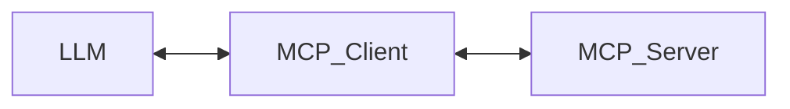
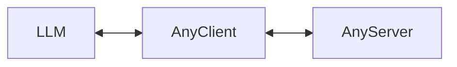

# MCP Client

## 内容

- 实现一个最基本的Client，让deepseek接入MCP生态
  - 核心架构
  - JSON-RPC 2.0
    - RPC是什么
- **MCP和Function Calling的区别**
- 各家API的差异
  - OpenAI / Anthropic / DeepSeek
- **参考5ire源码如何抹平API差异**

## MCP架构

https://modelcontextprotocol.io/docs/concepts/architecture

https://www.jsonrpc.org/

## MCP Client的实现

https://modelcontextprotocol.io/quickstart/client

https://github.com/modelcontextprotocol/typescript-sdk

- MCP Server: https://github.com/pskill9/hn-server
- Inspector: https://github.com/modelcontextprotocol/inspector

## MCP 和 Function Calling的区别

### MCP的tool调用

- MCP Client和MCP Server之间有严格的通讯协议
- Server端提供了统一的接口规范和服务注册机制
- Client端知道如何与Server通信，以及可用的服务列表
- 由于有**统一的协议规范**，不同开发者开发的工具可以很容易地被其他MCP客户端复用
- 服务端的注册机制使得工具的发现和共享变得简单

### FunctionCalling的tool调用

- 更像是模型的一个**基础能力**，LLM只负责识别需要调用什么功能
- Client自行决定如何实现这个功能调用
- 没有统一的服务发现和通信标准
- 不同客户端的plugin生态不能互相兼容
  - https://chat-plugin-sdk.lobehub.com/quick-start/get-start
  - https://www.librechat.ai/docs/development/tools_and_plugins

## API差异

https://platform.openai.com/docs/api-reference/chat

https://docs.anthropic.com/en/api/messages

https://api-docs.deepseek.com/api/create-chat-completion

- 差异
  1. function_calling的函数定义格式
  2. function_calling返回的数据结构
  3. 调用结束后，message的数据结构

## 5ire抹平API差异的方式

- 各家模型的API返回的数据结构不一样，如何抹平LLM模型的输出和mcp-client之间的差异？
- 既然知道不一样 → 就可以转换成一样的
- https://github.com/nanbingxyz/5ire

1. 函数定义方式不同 → ChatService的makeTool来处理
2. 函数调用结果不同 → Reader的parseReply和parseTools来处理
3. message格式不同 → ChatService的makeToolMessages来处理